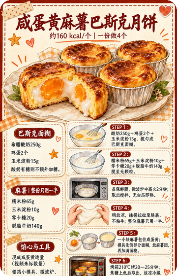

 

### ✦ About

- 🎓 在读博士，白天做研究，晚上把 AI Agent 调教成能照顾生活的小帮手
- 🧩 关注 **Agent Skills**：把一件具体的事拆成可复用、可验证、不胡编的流程
- 🍳 最近在做：让 AI 看懂做饭视频，输出一张照着就能做的图解食谱卡
- 🌿 相信好工具应该让日子更松弛，而不是更忙

 

### ✦ Featured

<table>
<tr>
<td width="38%" align="center" valign="middle">

</td>
<td width="62%" valign="middle">
<h3>🍳 <a href="https://github.com/mirandakaro/recipe-video-cards">recipe-video-cards</a></h3>
把小红书 / 抖音 / B 站的做饭视频，变成一张照着就能做的图解食谱卡。
  
<b>先取证</b>：抽帧、OCR、转写、翻评论区食材表 
<b>不编克数</b>：视频没给的用量，明确标「未标注」 
<b>生图后验图</b>：逐项核对图上文字，不通过就重画
  
   
</td>
</tr>
</table>

 

### ✦ Toolbox

 

✦ 链接丢进来，三餐端出去 ✦

